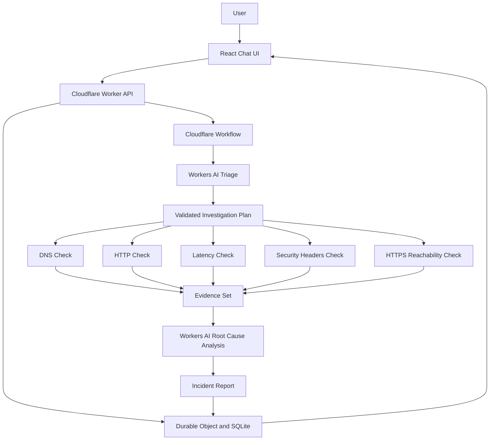

# EdgePulse

## AI Internet Incident Investigator

EdgePulse is an AI-powered Internet incident investigation platform built with React, TypeScript, Cloudflare Workers, Workers AI, Cloudflare Workflows, and SQLite-backed Durable Objects.

A user enters a website URL and describes an incident. EdgePulse uses an LLM to classify the problem, creates a safe investigation plan, runs diagnostic tools, analyzes the collected evidence, and presents a human-readable incident report.

## Architecture



  ## Application Screenshots

  ### Dashboard

  The dashboard shows active investigations, completed incidents, critical incidents, average investigation time, and recent incident history.

  

  ### New Investigation

  Users enter a target URL and describe the problem. Quick examples populate common incident scenarios.

  

  ### Incident Analysis and Evidence

  The incident report displays AI analysis, confidence, findings, remediation actions, limitations, and diagnostic evidence such as DNS, HTTP, latency, and security headers.

  

  ### Investigation Timeline

  The timeline shows progress through AI triage, diagnostic checks, evidence collection, and AI analysis.

  

  ### Conversation and Follow-up Chat

  Users can review the investigation conversation and ask follow-up questions about the collected evidence.

  

  ### Additional Investigation Views

  

  

## End-to-End Flow

1. The user opens the React dashboard.
2. The user enters a target URL and incident description.
3. The frontend sends the request to `POST /api/incidents`.
4. The Cloudflare Worker validates the URL and protects against SSRF attacks.
5. The Worker creates an incident in the `IncidentSession` Durable Object.
6. The Worker starts `IncidentInvestigationWorkflow`.
7. The Workflow sends the incident to Workers AI for triage.
8. Workers AI returns structured JSON containing the incident type, severity, reasoning, and selected tools.
9. The plan is validated against the predefined tool allowlist.
10. The Workflow executes the selected diagnostic tools.
11. Each tool result is recorded as evidence in Durable Object SQLite storage.
12. The Workflow loads historical context for the target URL.
13. Workers AI analyzes the original question and collected evidence.
14. The final analysis produces findings, likely causes, confidence, remediation actions, and limitations.
15. The final report is persisted in the Durable Object.
16. The React UI displays the incident report, evidence, timeline, and conversation.
17. Users can ask follow-up questions or replay a completed investigation.

## Cloudflare Components

### React Frontend

The frontend provides:

- Incident creation form
- Incident history
- Investigation progress timeline
- Evidence dashboard
- AI analysis report
- Follow-up chat
- Investigation replay

Main location: `src/frontend/`

### Cloudflare Worker

The Worker is the application API and request router. It validates requests, applies rate limiting, communicates with Durable Objects, starts Workflows, and serves the frontend assets.

Main location: `src/worker/index.ts`

Important endpoints:

- `POST /api/incidents`
- `GET /api/incidents`
- `GET /api/incidents/:id`
- `POST /api/incidents/:id/chat`
- `POST /api/incidents/:id/replay`
- `GET /api/incidents/:id/results`
- `GET /api/health`

### Workers AI

Workers AI participates in two important reasoning stages:

#### Stage 1: Incident Triage

The model classifies the incident and selects diagnostic tools from the safe allowlist:

- `check_dns`
- `check_http`
- `check_latency`
- `check_security_headers`
- `check_https_reachability`

The response is parsed and validated with Zod before the Workflow can use it.

#### Stage 2: Root Cause Analysis

The model receives the original incident, investigation plan, diagnostic evidence, and historical context. It produces:

- Summary
- Incident type
- Severity
- Evidence findings
- Likely root cause
- Analytical confidence score
- Recommended remediation actions
- Limitations

Main location: `src/ai/ai-service.ts`

### Cloudflare Workflow

`IncidentInvestigationWorkflow` is the durable orchestration layer. Each important stage is implemented as a retryable Workflow step.

Main location: `src/workflows/investigation-workflow.ts`

Workflow stages:

1. Update incident status to `planning`.
2. Run AI incident triage.
3. Persist the validated investigation plan.
4. Set the incident to `investigating`.
5. Execute the selected diagnostic tools.
6. Persist every tool result and tool status.
7. Load historical incident context.
8. Set the incident to `analyzing`.
9. Run AI root cause analysis.
10. Persist the final analysis and remediation plan.
11. Mark the incident as `completed`.

Individual diagnostic failures are recorded and do not stop the other tools from running.

### Durable Object and SQLite Memory

`IncidentSession` provides persistent incident memory using SQLite-backed Durable Object storage.

Main location: `src/durable-objects/incident-session.ts`

Stored data includes:

- Incidents
- Conversation messages
- Investigation steps
- Diagnostic tool results
- AI analysis
- Confidence and severity values

This allows the frontend to reload incident history and continue follow-up conversations after Worker restarts.

## Diagnostic Tools

The tool layer contains known, safe TypeScript functions. The LLM cannot execute arbitrary code or shell commands.

- `check_dns`: resolves DNS records through DNS-over-HTTPS.
- `check_http`: checks HTTP status, response time, redirects, and safe response headers.
- `check_latency`: measures response latency and classifies it using configurable thresholds.
- `check_security_headers`: checks common security headers and calculates an observation score.
- `check_https_reachability`: checks HTTP and HTTPS reachability and redirect behavior.

Main location: `src/tools/`

## Security Model

- Only `http://` and `https://` URLs are accepted.
- Private, loopback, link-local, metadata, and internal host targets are blocked.
- Redirect destinations are validated before they are followed.
- Diagnostic tools use timeouts and avoid downloading large response bodies.
- LLM tool selections are validated against a fixed allowlist.
- LLM output is validated with Zod schemas.
- User content is not rendered as arbitrary HTML.
- No automatic production changes, shell execution, or destructive remediation is performed.
- Rate limiting protects API endpoints from excessive requests.

## Demo Mode

Demo Mode provides deterministic simulated evidence so the full Workflow and UI can be demonstrated without external network access or AI credentials.

Demo results are clearly labeled `DEMO DATA` and must not be interpreted as real measurements.

## Python LLM Adapter

The project also includes a standalone Python implementation and optional HTTP bridge. It is not required for the primary Cloudflare architecture.

```text
React UI -> Cloudflare Worker -> Workers AI
                         or
React UI -> Cloudflare Worker -> Python LLM bridge -> OpenAI/Cloudflare AI
```

The primary production architecture uses Workers AI directly. The Python bridge is useful when a Python LLM provider or compatible API is preferred.

## Local Development

Install frontend dependencies:

```powershell
npm install
```

Run the Cloudflare application:

```powershell
npm run dev
```

Open:

```text
http://127.0.0.1:8787
```

For reliable local Workflow demonstrations, use Demo Mode in the UI or set local variables in `.dev.vars`:

```text
DEMO_MODE=true
```

Run the optional Python bridge from a second terminal:

```powershell
cd python
python -m edgepulse.server
```

## Testing

```powershell
npm test
npm run typecheck
npm run lint
cd python
python -m pytest -q
```

## Deployment

Authenticate Wrangler:

```powershell
npx wrangler login
```

Build and deploy:

```powershell
npm run deploy
```

The Cloudflare bindings are configured in `wrangler.toml`:

- Workers AI
- Durable Object `IncidentSession`
- SQLite Durable Object migration
- Workflow `IncidentInvestigationWorkflow`
- Static frontend assets

## Limitations

- Measurements are made from the Worker execution location.
- Origin CPU, memory, database, and internal application metrics are unavailable.
- Confidence is an analytical estimate, not a formal probability.
- Certificate internals are not fabricated when the runtime does not expose them.
- A local Python bridge cannot be reached by a remote Cloudflare Workflow through `127.0.0.1`; deployed Python usage requires a reachable HTTPS service.

## Requirement Mapping

| Requirement | Implementation |
|---|---|
| LLM | Workers AI in `src/ai/ai-service.ts` |
| Workflow and coordination | `IncidentInvestigationWorkflow` in `src/workflows/investigation-workflow.ts` |
| User input | React UI in `src/frontend/` |
| Memory and state | SQLite-backed `IncidentSession` Durable Object |
| Diagnostic tools | TypeScript tools in `src/tools/` |
| Prompt history | `PROMPT_HISTORY.md` |
| Deployment configuration | `wrangler.toml` |

## Project Structure

```text
src/
  ai/                  Workers AI integration
  durable-objects/    SQLite-backed incident memory
  frontend/            React user interface
  prompts/             Triage, analysis, and follow-up prompts
  schemas/             Zod validation schemas
  tools/               Safe diagnostic tools and demo data
  types/               Shared TypeScript types
  utils/               Validation, logging, rate limiting, and helpers
  worker/              Cloudflare Worker API entry point
  workflows/           Durable investigation workflow
python/
  edgepulse/          Standalone Python agent and LLM adapter
  tests/               Python tests
README.md              Main project documentation
READ.MD                Architecture and assignment summary
PROMPT_HISTORY.md      AI prompt history
wrangler.toml          Cloudflare deployment configuration
```
