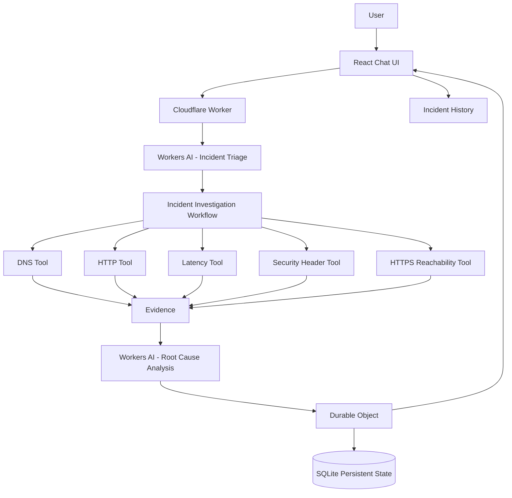

# EdgePulse — AI Internet Incident Investigator

An AI-powered Internet incident investigation platform built entirely on Cloudflare's edge stack. Enter a URL and a problem description — EdgePulse will diagnose, analyze, and recommend using LLM-powered reasoning and real diagnostic tools.

## Problem

When Internet services experience issues (slow responses, DNS failures, TLS problems, HTTP errors), diagnosing the root cause requires running multiple diagnostic checks, correlating evidence, and applying expert knowledge. This is time-consuming and requires specialized skills.

## Solution

EdgePulse automates the incident investigation workflow:

1. **User reports a problem** — enters a URL and describes the issue
2. **AI triages** — LLM classifies the incident and plans the investigation
3. **Workflow executes** — Cloudflare Workflow runs diagnostic tools
4. **Evidence collected** — DNS, HTTP, latency, security headers, HTTPS reachability
5. **AI analyzes** — LLM performs root cause analysis on the evidence
6. **Report generated** — structured report with findings, confidence, and remediation
7. **History persisted** — all data stored in Durable Objects with SQLite

## Features

- 🧠 **AI-Powered Triage** — LLM classifies incidents and plans investigations
- 🔬 **Root Cause Analysis** — Evidence-based analysis with confidence scoring
- 🌐 **DNS Diagnostics** — DNS-over-HTTPS lookup via Cloudflare (1.1.1.1)
- 📡 **HTTP Monitoring** — Status codes, latency, redirects, content analysis
- ⏱️ **Latency Measurement** — Multi-sample with configurable thresholds
- 🛡️ **Security Audit** — 6 security headers checked and scored
- 🔒 **HTTPS Reachability** — Protocol accessibility and redirect detection
- 💬 **Conversational Interface** — Follow-up questions with incident context
- 🔄 **Incident Replay** — Re-run diagnostics and compare with historical data
- 📊 **Dashboard** — Stats, incident history, search, and filters
- 🎭 **Demo Mode** — Works offline with deterministic mock data
- 🔐 **SSRF Protection** — Blocks private IPs, metadata endpoints, internal networks

## Architecture



## Application Screenshots

### Dashboard Overview


### Diagnostics Dashboard


### Platform Settings


### Incident Directory


### Recent Incidents Dashboard


### New Investigation


### Investigation Configuration


## Cloudflare Services

| Service | Usage |
|---------|-------|
| **Cloudflare Workers** | API routing, request handling, frontend serving |
| **Workers AI** | LLM-powered incident triage and root cause analysis |
| **Cloudflare Workflows** | Durable orchestration of diagnostic steps |
| **Durable Objects** | Persistent state with SQLite for incidents, messages, results |
| **Static Assets** | Serving the React frontend |

## Data Flow

```
User Question → Worker API → Durable Object (create incident)
  → Workers AI (triage) → Workflow (run diagnostics)
  → DNS Check + HTTP Check + Latency Check + Security Headers + HTTPS Check
  → Evidence Collection → Workers AI (analysis)
  → Durable Object (persist) → React UI (display)
```

## LLM Architecture

### Stage 1 — Incident Triage
- Classifies incident type (availability, latency, dns, tls, http, security, infrastructure, mixed, unknown)
- Assesses initial severity
- Selects diagnostic tools from allowlist
- Returns structured JSON validated by Zod

### Stage 2 — Root Cause Analysis
- Receives all diagnostic evidence
- Identifies likely root causes
- Distinguishes facts from inference
- Assigns confidence score (0-1)
- Recommends remediation actions
- States analysis limitations

### Follow-Up Conversation
- Uses incident context (not full database)
- Answers questions based on collected evidence
- Does not invent unavailable data

## Workflow Architecture

The `IncidentInvestigationWorkflow` uses Cloudflare Workflows with 10 durable steps:

1. Update status to planning
2. LLM incident triage
3. Persist investigation plan
4. Run diagnostic tools
5. Persist diagnostic results
6. Load historical context
7. Update status to analyzing
8. LLM root cause analysis
9. Persist final report
10. Mark incident completed

Each step is independently retryable. Individual tool failures are recorded but don't crash the workflow.

## Durable Object Memory

### SQLite Tables

| Table | Purpose |
|-------|---------|
| `incidents` | Incident metadata (id, url, type, severity, status, confidence) |
| `messages` | Conversation history (role, content) |
| `investigation_steps` | Step-by-step progress tracking |
| `tool_results` | JSON-serialized diagnostic results |
| `analysis` | AI analysis and remediation data |

## Diagnostic Tools

| Tool | Description |
|------|-------------|
| `check_dns` | DNS-over-HTTPS lookup via 1.1.1.1 (A, AAAA, CNAME records) |
| `check_http` | HTTP/HTTPS request with status, latency, redirects, headers |
| `check_latency` | Multi-sample latency measurement with classification |
| `check_security_headers` | 6 security headers checked (HSTS, CSP, X-Content-Type-Options, etc.) |
| `check_https_reachability` | HTTPS/HTTP accessibility and redirect behavior |

## Security

- **SSRF Prevention** — Blocks private IPs (127.0.0.0/8, 10.0.0.0/8, 172.16.0.0/12, 192.168.0.0/16), link-local, IPv6 loopback, metadata endpoints, internal hostnames
- **Input Validation** — Zod schemas for all API inputs; URL validation with protocol and port checks
- **LLM Output Validation** — Zod schemas with retry on parse failure
- **Rate Limiting** — Sliding window per IP
- **Tool Allowlist** — LLM can only select from 5 predefined tools
- **No Arbitrary Execution** — No shell commands, no code execution, no production mutations
- **Safe Rendering** — HTML escaping, no arbitrary HTML from LLM
- **No Client-Side Secrets** — All AI bindings server-side only

## Local Development

```bash
# Install dependencies
npm install

# Run locally (uses Wrangler)
npm run dev

# Run with remote Workers AI
npx wrangler dev --remote
```

### Use the Python LLM with the frontend

The React frontend normally uses Workers AI through the TypeScript Worker. To use the Python `LlmClient` instead, run the bridge in a second terminal:

```powershell
cd python
python -m edgepulse.server
```

Then, from the project root, point Wrangler at it:

```powershell
cd ..
$env:PYTHON_LLM_URL = "http://127.0.0.1:8090"
npm run dev
```

The Worker proxies triage, root-cause analysis, and follow-up chat to Python. The Python client uses `LLM_PROVIDER`, `OPENAI_API_KEY`, `CLOUDFLARE_API_TOKEN`, and related settings documented in [README_PYTHON.md](README_PYTHON.md). For a deployed Worker, `PYTHON_LLM_URL` must be a reachable HTTPS service; `127.0.0.1` only works for local development.

## Environment Variables

| Variable | Default | Description |
|----------|---------|-------------|
| `ENVIRONMENT` | `development` | Environment identifier |
| `AI_MODEL` | `@cf/meta/llama-3.3-70b-instruct-fp8-fast` | Workers AI model |
| `MAX_INCIDENT_HISTORY` | `50` | Max incidents in history |
| `REQUEST_TIMEOUT_MS` | `10000` | HTTP request timeout |
| `LATENCY_LOW_MS` | `300` | Low latency threshold |
| `LATENCY_MODERATE_MS` | `1000` | Moderate latency threshold |
| `LATENCY_HIGH_MS` | `2000` | High latency threshold |
| `DEMO_MODE` | `false` | Enable demo mode globally |

## Testing

```bash
# Run all tests
npm test

# Run in watch mode
npm run test:watch

# TypeScript typecheck
npm run typecheck
```

### Test Coverage
- URL validation & SSRF protection (20+ test cases)
- Latency classification with custom thresholds
- Demo data integrity for all tools
- Zod schema validation (triage, analysis, follow-up, API inputs)
- Incident ID generation and uniqueness
- Helper utilities (HTML escaping, truncation, duration formatting)
- Tool allowlist enforcement

## Deployment

```bash
# Build frontend + deploy
npm run deploy

# Or step by step:
npm run build:frontend
npx wrangler deploy
```

**Prerequisites:**
- Cloudflare account with Workers, AI, Durable Objects, and Workflows enabled
- Wrangler authenticated (`npx wrangler login`)

## API Endpoints

| Method | Path | Description |
|--------|------|-------------|
| `POST` | `/api/incidents` | Create new incident |
| `POST` | `/api/incidents/:id/start` | Trigger investigation workflow |
| `GET` | `/api/incidents/:id` | Get incident details + analysis |
| `GET` | `/api/incidents` | List incidents (search, filter, sort) |
| `GET` | `/api/incidents/:id/messages` | Get conversation messages |
| `GET` | `/api/incidents/:id/results` | Get diagnostic results |
| `GET` | `/api/incidents/:id/analysis` | Get AI analysis |
| `GET` | `/api/incidents/:id/steps` | Get investigation steps |
| `POST` | `/api/incidents/:id/chat` | Send follow-up message |
| `POST` | `/api/incidents/:id/replay` | Replay investigation |
| `GET` | `/api/stats` | Dashboard statistics |
| `POST` | `/api/tools/test` | Test individual diagnostic tool |
| `GET` | `/api/health` | Health check |

## Example Investigation

**Input:**
- URL: `https://example.com`
- Problem: "Users are reporting that the website is slow."

**Expected Flow:**
1. ✅ Incident created (INC-20260919-0001)
2. ✅ AI triage → Type: latency, Severity: high
3. ✅ Investigation plan: DNS, HTTP, Latency, Security Headers, HTTPS
4. ✅ DNS check → Healthy (2 records, 45ms)
5. ✅ HTTP check → 200 OK (1820ms)
6. ✅ Latency check → 1820ms (high)
7. ✅ Security headers → 5/6 (Permissions-Policy missing)
8. ✅ HTTPS reachability → Accessible, redirects to HTTPS
9. ✅ AI analysis → Root cause: origin performance degradation
10. ✅ Confidence: 84%
11. ✅ Remediation: Investigate origin CPU/memory/database

## Limitations

- **External measurement only** — Cannot access origin server internals
- **No direct certificate inspection** — Workers runtime limits TLS introspection
- **LLM confidence is analytical** — Not a formal probability
- **Rate limits apply** — Workers AI and diagnostic tools have rate limits
- **Single measurement point** — Tests from Cloudflare's edge, not multiple locations
- **Demo mode is simulated** — Demo data does not reflect real diagnostics

## Future Improvements

- WebSocket for real-time investigation updates
- Multi-location diagnostic checks
- Custom diagnostic tool plugins
- Integration with external monitoring (Datadog, PagerDuty)
- Incident comparison and trending
- PDF/Markdown report export
- User authentication and team sharing
- Custom latency thresholds per investigation

## Assignment Requirement Mapping

| Requirement | Implementation |
|-------------|---------------|
| **LLM** | Workers AI (`@cf/meta/llama-3.3-70b-instruct-fp8-fast`) — `src/ai/ai-service.ts` |
| **Workflow / Coordination** | Cloudflare Workflows — `src/workflows/investigation-workflow.ts` |
| **User Input** | React chat interface — `src/frontend/components/NewIncident.tsx`, `IncidentChat.tsx` |
| **Memory / State** | Durable Objects + SQLite — `src/durable-objects/incident-session.ts` |
| **Diagnostic Tools** | 5 TypeScript tools — `src/tools/*.ts` |
| **SSRF Protection** | URL validator — `src/utils/url-validator.ts` |
| **LLM Prompts** | Structured prompts — `src/prompts/triage.ts`, `analysis.ts`, `followup.ts` |
| **Schema Validation** | Zod — `src/schemas/incident.ts` |
| **API Design** | RESTful endpoints — `src/worker/index.ts` |
| **Testing** | Vitest — `tests/*.test.ts` |
| **CI** | GitHub Actions — `.github/workflows/ci.yml` |
| **Demo Mode** | Mock data — `src/tools/demo-data.ts` |
| **Incident Replay** | Comparison feature — `POST /api/incidents/:id/replay` |
| **Dashboard** | Stats + history — `src/frontend/components/Dashboard.tsx` |
| **Prompt History** | `PROMPT_HISTORY.md` |
